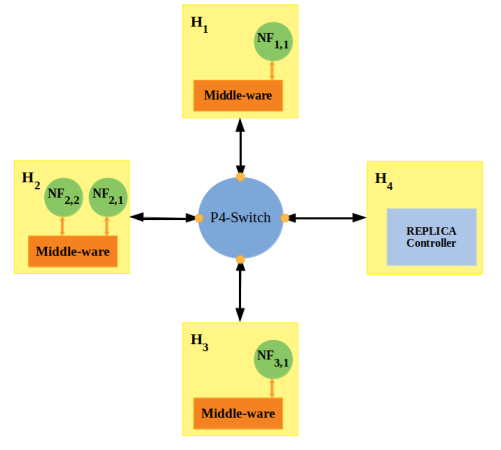

# State Sharing with P4

## Introduction

In this repository a sample solution for State sharing is prepared
by help of the `P4 language`, `python` and the `PUBLISH/SUBSCRIBE` scheme.

In simple words, we have some `Network Functions` that want to `Publish` 
information on some `variables`, they are not aware of each other existence
or the place of the other Network Functions in the network, and they want
to have a selective access to the others publishes.
Their information is limited to the variable names and the address of 
the `REPLICA controller`. We tried to implement a simple case that can 
demonestrate well the idea.

For the sack of simplicity, we start four hosts, then we run four Network
Functions inside three of those hosts(two hosts has only one Network Function
and one host has two Network Functions) and one REPLICA controller inside
the forth host.

In this implementation, all the Network Functions will initialize themselves
by communicating with the REPLICA controller and each one will publish on one 
unique variable, then one of the two Network Functions which is sharing the
same host, will SUBSCRIBE on the other three variables which are being published
by the other three Network Functions. The P4 switch is responcible to do the 
registerations and forward the publishes to the subscribers.

**HINT**
In this example, the subscriber Network Function is sharing its host with one of 
the publisher Network Functions, as the subscriber Network Function is subscribing 
on the variable of this publisher Network Function, so do we need to route the 
published data to the P4 switch and then again to the same host? 
As an example for the solution to save the resources(bandwith, P4 switch internal
resources, etc.), we implemented a simple `Middle-ware` to be placed between the 
Network Functions of each host and the host itself.

A simple structure is showned here: 

## Presentation

1. By using the internal registers
* [Register-based solution](./pubsub/pubsub_register)

For starting with the P4 language, one can refer to the [P4 tutorial](https://github.com/p4lang/tutorials), prepared by the [P4.ORG](https://p4.org/) as a learning source.

## Obtaining required software

The environment for running and the instructions for this part
is derived from the [P4 tutorial](https://github.com/p4lang/tutorials).

To run the proposed solutions, you will need to either build a
virtual machine or install several dependencies.

To build the virtual machine:
- Install [Vagrant](https://vagrantup.com) and [VirtualBox](https://virtualbox.org)
- Clone the repository
- `cd vm`
- `vagrant up`
- Log in with username `p4` and password `p4` and issue the command `sudo shutdown -r now`
- When the machine reboots, you should have a graphical desktop machine with the required
software pre-installed.

*Note: Before running the `vagrant up` command, make sure you have enabled virtualization in your environment; otherwise you may get a "VT-x is disabled in the BIOS for both all CPU modes" error. Check [this](https://stackoverflow.com/questions/33304393/vt-x-is-disabled-in-the-bios-for-both-all-cpu-modes-verr-vmx-msr-all-vmx-disabl) for enabling it in virtualbox and/or BIOS for different system configurations.

You will need the script to execute to completion before you can see the `p4` login on your virtual machine's GUI. In some cases, the `vagrant up` command brings up only the default `vagrant` login with the password `vagrant`. Dependencies may or may not have been installed for you to proceed with running P4 programs. Please refer the existing issues to help fix your problem or create a new one if your specific problem isn't addressed there.*

To install dependencies by hand, please reference the [vm](../vm) installation scripts.
They contain the dependencies, versions, and installation procedure.
You should be able to run them directly on an Ubuntu 16.04 machine, although note that the scripts currently assume the existence of a directory `/home/vagrant`:
- `sudo ./root-bootstrap.sh`
- `sudo ./user-bootstrap.sh`
